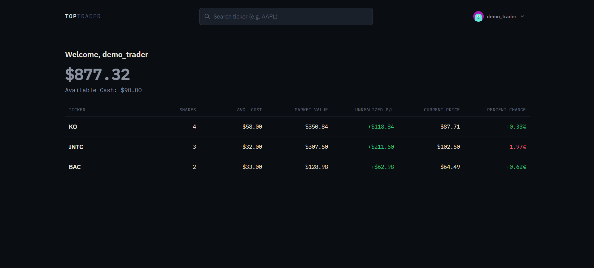
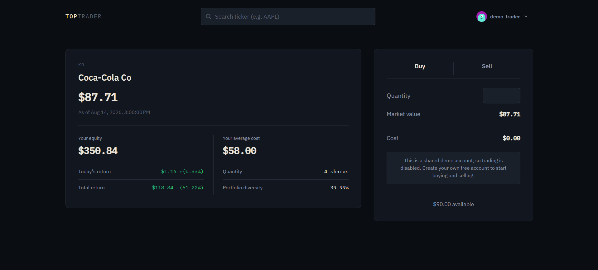
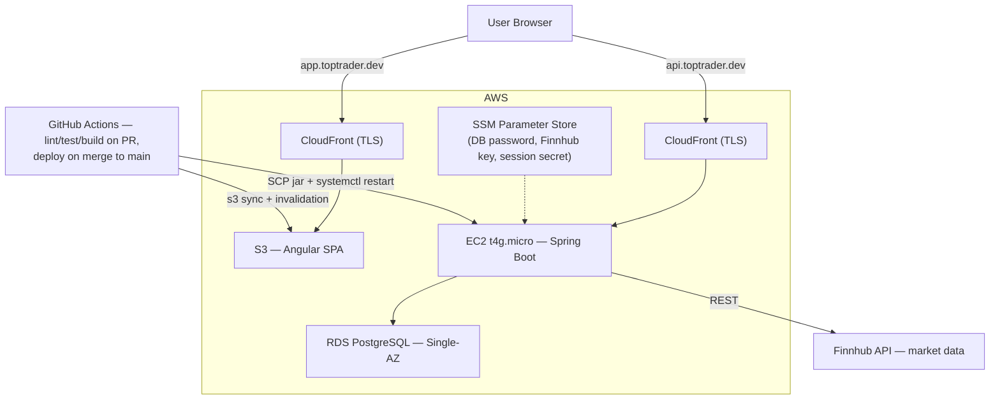

# TopTrader

A stock trading simulator that lets you practice buying and selling with virtual cash against real market data — no brokerage account, no real money at risk.

[](https://github.com/Efren707/toptrader/actions/workflows/ci.yml)
[](./LICENSE)

**Live at [app.toptrader.dev](https://app.toptrader.dev)** — click **Try Demo** on the login page for an instant, read-only walkthrough (seeded portfolio, no signup), or register your own account and start with $500 in virtual cash.

Built in public with the full requirements → architecture → decision-making process documented in [`/docs`](./docs), including 49 [ADRs](./docs/adr) recording *why*, not just *what*.

## Problem

Most free paper-trading tools are either bolted onto a real broker's platform (locked to that broker's UX) or too simplistic to reflect real constraints — cost-basis tracking, transaction history, cash management. TopTrader is a standalone simulator: register, get $500 in virtual cash (deliberately modest, not the usual $100k demo balance, so position sizing actually matters), and trade real tickers at live prices. It's built as a full-stack engineering showcase first — a working, deployed app a reviewer can actually click through, not just read about — with social/competitive features (friends, profit-ranked leaderboards) layered on incrementally post-MVP.

## Screenshots

| Dashboard | Buy/sell flow |
|---|---|
|  |  |

## Features

- Register and log in with server-side session auth (email + password, Argon2id hashing)
- $500 in virtual starting cash on signup
- Look up any ticker's live price via the Finnhub API
- Buy/sell whole shares, with weighted-average cost-basis tracking across repeat buys
- Portfolio view: current holdings, cash balance, live valuation
- Full transaction history and overall profit/loss vs. starting cash
- Edit profile (username, email, password, avatar) and self-service account deletion
- One-click **Try Demo** login with a pre-seeded, read-only portfolio for reviewers

## Architecture



Angular SPA (`app.`) and Spring Boot REST API (`api.`) on subdomains of one parent domain, so the session cookie can be scoped `SameSite=Lax` across both without falling back to `SameSite=None`. Single EC2 instance by design (see trade-offs below) — CloudFront sits in front of it purely for TLS termination, since ACM certs can't attach directly to a bare instance. Full container-level diagram, component notes, and data model: [`docs/architecture/`](./docs/architecture).

## Tech decisions & trade-offs

Each row is a real ADR, not a rationalization after the fact — the linked doc has the options considered and why the alternative lost.

| Area | Chosen | Trade-off | Why |
|---|---|---|---|
| Auth | Server-side sessions (Spring Session) | over JWT | No token storage/XSS exposure, free `SameSite` CSRF mitigation, instant server-side revocation. JWT's statelessness benefits (multi-service, mobile clients) don't apply to a single SPA + single API — [ADR 0004](./docs/adr/0004-auth-strategy.md) |
| Compute | EC2 t4g.micro, single instance | over ECS Fargate | Fargate needs an ALB for a stable HTTPS endpoint (~$16+/mo fixed) that buys nothing at this traffic level — no real need for load balancing or horizontal scale. ~$18-20/mo total vs. ~$37-40/mo — [ADR 0005](./docs/adr/0005-aws-deployment-shape.md) |
| Trade execution | Row-level locking (`SELECT ... FOR UPDATE`) + stored running balances | over deriving balances by replaying the transaction log on every read | Cheap portfolio reads; the `transactions` table stays the immutable audit log of record either way. Locking prevents lost updates/overspending under concurrent buy/sell requests — [ADR 0010](./docs/adr/0010-data-model.md) |
| Rate limiting | bucket4j, in-process, mixed IP/user keying | over a hand-rolled map or AWS WAF | No Redis needed — matches the single-instance deployment exactly. A hand-rolled counter map leaks memory without careful eviction; WAF adds recurring cost for no real gain at this traffic scale — [ADR 0034](./docs/adr/0034-api-rate-limiting.md) |
| Deploy safety | Automated last-known-good jar rollback | over a second EC2 instance (blue/green) | Self-heals within the same CI run when a post-deploy health check fails — zero manual intervention, $0 added cost. Blue/green would double compute cost for a benefit this traffic level doesn't need — [ADR 0039](./docs/adr/0039-rollback-strategy.md) |
| Market data | Finnhub | over Twelve Data / Alpha Vantage / Polygon | 60 req/min free tier with no daily cap comfortably covers dev + demo traffic; competitors were either rate-limited to the point of unusable (25/day) or delayed-only — [ADR 0003](./docs/adr/0003-market-data-api.md) |
| Frontend state | Native Angular signals in injectable services | over NgRx | The app has ~4-5 pieces of real state and no complex derived/cross-cutting state — NgRx's action/reducer/effect boilerplate isn't earning its keep here — [ADR 0013](./docs/adr/0013-frontend-architecture.md) |
| Styling | Tailwind CSS | over Angular Material | Full design control and a smaller runtime footprint, at the cost of hand-building accessible interactive widgets (e.g. the buy/sell confirm dialog) instead of inheriting them from a component library — [ADR 0013](./docs/adr/0013-frontend-architecture.md) |
| Authorization | Service-layer `@PreAuthorize` binding every `userId` param to the authenticated principal | over a default-deny method-security framework | Matches the actual risk shape (every endpoint scopes by `userId`) without infrastructure sized for a multi-contributor codebase — turns "forgot to derive userId from the principal" into a 403 instead of a silent IDOR — [ADR 0035](./docs/adr/0035-authorization-guard.md) |

## Tech stack

- **Backend**: Spring Boot (Java 21), server-side sessions, Argon2id, bucket4j rate limiting
- **Database**: PostgreSQL, Flyway migrations
- **Frontend**: Angular (standalone components, signals), Tailwind CSS, Vitest
- **Infra**: AWS (EC2, RDS, S3, CloudFront, Route 53, SSM Parameter Store, SES, WAF), Terraform-free hand-provisioned under a ~$20/month budget
- **CI/CD**: GitHub Actions — lint/test/build gate on every PR, auto-deploy on merge to `main`, automated health-check rollback

## Running it locally

Prerequisites: JDK 21, Node/npm, Docker, Git.

```bash
git clone https://github.com/Efren707/toptrader.git
cd toptrader

# 1. Start Postgres
docker compose up -d

# 2. Backend config — copy the example and add your own free Finnhub key
#    (get one at https://finnhub.io/register)
cp backend/src/main/resources/application-local.yml.example \
   backend/src/main/resources/application-local.yml
# edit application-local.yml: toptrader.finnhub.api-key

# 3. Run the backend (port 8080)
cd backend && ./mvnw spring-boot:run -Dspring-boot.run.profiles=local

# 4. Run the frontend (port 4200), in a separate terminal
cd frontend && npm install && npm start
```

Visit `http://localhost:4200` and register an account — CORS is already configured for `localhost:4200` ↔ `localhost:8080`. Full walkthrough (including running the test suites): [`docs/guides/developer-setup-guide-outline.md`](./docs/guides/developer-setup-guide-outline.md).

## Documentation

- [Requirements & Planning](./docs/requirements) — vision, user stories, NFRs, acceptance criteria
- [Architecture](./docs/architecture) — system/data/frontend/security/deployment design, API contract
- [Architecture Decision Records](./docs/adr) — the "why" behind every notable technical/process call
- [Guides](./docs/guides) — setup, contribution workflow

## Contributing

Solo project, but run with a real trunk-based workflow: `main` is always deployable, work happens on short-lived `feature/*`/`fix/*` branches merged via PR once CI (lint, test, build) is green. Every notable decision gets an ADR. Full process: [`CONTRIBUTING.md`](./CONTRIBUTING.md).

## License

[MIT](./LICENSE)
