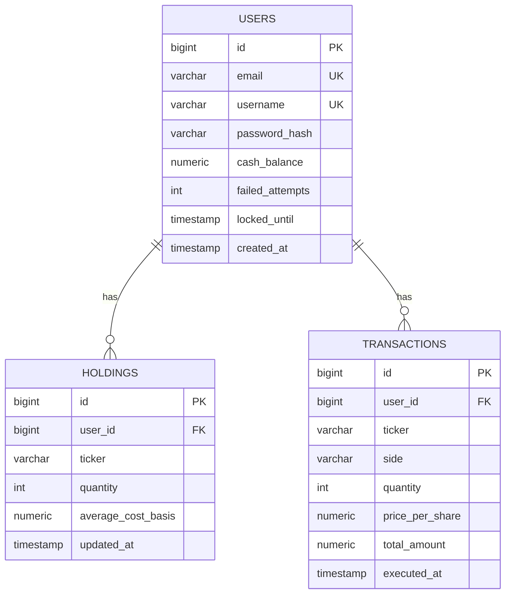

# Data Model

> Entity/table design covering all MVP user stories (US-1..US-9). Companion to [system-architecture.md](./system-architecture.md). Schema migration tooling (Flyway vs. Liquibase) is a separate, still-open Phase 3 item.

## ERD

`HOLDINGS` has a unique constraint on `(user_id, ticker)`; a row is deleted (or its quantity goes to zero and is removed) when a sell fully liquidates the position.

There is deliberately no `stocks`/`quotes` table — ticker is a plain string on `holdings`/`transactions`, and company name/price/as-of timestamp are always fetched live from Finnhub (price caching is explicitly out of MVP scope, per `user-stories.md`). There is also no `sessions` table — ADR 0004 uses Spring's default in-memory `HttpSession` store, not a DB-backed session store.

## Story → data mapping

| Story | Tables/fields used |
|---|---|
| US-1 Register | `users.email`, `username`, `password_hash`, `created_at` |
| US-2 Log in | `users.email`, `password_hash`, `failed_attempts`, `locked_until` |
| US-3 Starting cash | `users.cash_balance` set to 500.00 once at registration |
| US-4 Quote lookup | no storage — live Finnhub call only |
| US-5 Buy shares | `users.cash_balance` (decrement), `holdings` (create/increase), `transactions` (insert, side=BUY) |
| US-6 Sell shares | `users.cash_balance` (increment), `holdings` (decrease/remove), `transactions` (insert, side=SELL) |
| US-7 View portfolio | `users.cash_balance`, `holdings.*` (current price fetched live, not stored) |
| US-8 Transaction history | `transactions.*`, filtered by `user_id`, ordered by `executed_at desc` |
| US-9 View P&L | `users.cash_balance` + Σ(`holdings.quantity` × live price) − 500 (starting cash constant) |

## Design decisions

- **Balances are stored, not derived.** `users.cash_balance` and `holdings.quantity`/`average_cost_basis` are maintained as running totals, updated in the same DB transaction as each `transactions` insert, with row-level locking to prevent lost updates under concurrent buy/sell requests (satisfies the NFR's "no lost updates or overspending from race conditions" requirement). This keeps portfolio reads (US-7) cheap — no need to replay full transaction history on every page load — while `transactions` remains the immutable source-of-truth audit log the NFR requires.
- **Bigint auto-increment primary keys**, not UUIDs. Authorization is already enforced server-side on every request (NFR), so there's no reliance on IDs being non-guessable; bigint keeps joins/indexes simple and small.
- **$500 starting cash is an app-level constant**, not a stored `starting_cash` column — it's the same for every MVP user (no deposit feature yet) and doubles as the P&L baseline in US-9. Revisit when the post-MVP "deposit additional cash" story lands, since P&L will then need to track net deposits rather than a fixed constant.
- **`username` is a display-only handle**, unique and required at registration, but login remains email+password only — no change needed to ADR 0004's auth flow or the US-2 acceptance criteria.
- **`side` column representation** (Postgres native enum vs. `varchar` + check constraint) is left open, to be settled alongside the Flyway vs. Liquibase migration-tooling decision.

## Carried forward / not yet built

- **Avatar selection** (user picks from a set of preset character avatars) — noted as a post-MVP idea in `docs/requirements/user-stories.md`. Would eventually need an `avatar_key` column (or reference table) on `users`; not part of the MVP schema.
