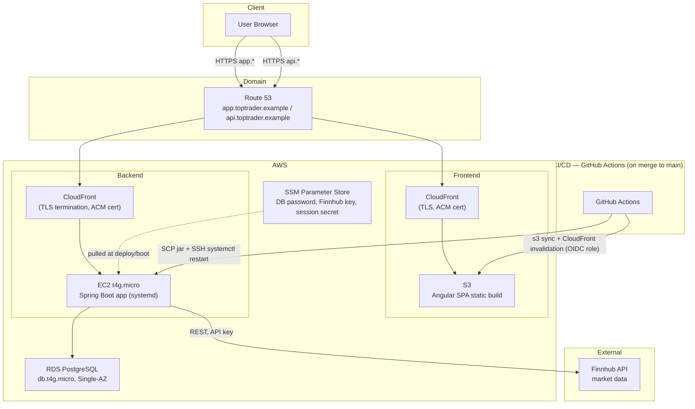

# System Architecture

> High-level container view of TopTrader's production topology and deploy path. Reflects decisions from ADR 0003 (Finnhub), ADR 0004 (session auth), ADR 0005 (AWS deployment shape), ADR 0006 (CI/CD pipeline), and ADR 0009 (local dev tooling). Component-level detail (data model, API contract, security architecture, frontend structure) is covered in later Phase 3 docs.

## Component notes

- **Domain split**: `app.` (frontend) and `api.` (backend) subdomains share one parent domain so the session cookie set by the backend can be scoped `SameSite=Lax` and read across both — the constraint carried in from ADR 0004.
- **TLS**: terminates at CloudFront on both paths (ACM certs are free but can't attach directly to a bare EC2 instance — this is *why* CloudFront sits in front of the backend even though there's only one origin).
- **Session state**: lives only in the single EC2 instance's memory/DB-tracked lockout table (ADR 0004) — no shared session store, which is only safe because ADR 0005 deliberately keeps backend compute to one instance (no horizontal scaling).
- **Runtime secrets**: DB password, Finnhub API key, and session-signing secret live in SSM Parameter Store and are pulled onto EC2 at deploy/boot time — never baked into the jar or committed (ADR 0006, ADR 0009).
- **Deploy path**: GitHub Actions runs lint → test → build on every PR (required check), then on merge to `main` deploys the frontend via OIDC-assumed role (`s3 sync` + CloudFront invalidation) and the backend via SCP + SSH `systemctl restart` — no blue/green, so a bad deploy causes a brief interruption (accepted trade-off, ADR 0005/0006).
- **Market data**: EC2 calls Finnhub directly from the backend (not proxied through the frontend); Finnhub has no market-status field, so open/closed state is computed from a trading calendar in the app (open item carried from ADR 0003).

## Out of scope for this diagram

- Internal request/response flow for specific use cases (e.g. login, placing a trade) — candidate for a follow-up sequence diagram if useful later.
- Data model / ERD — next Phase 3 item.
- API contract — separate Phase 3 item (OpenAPI).
